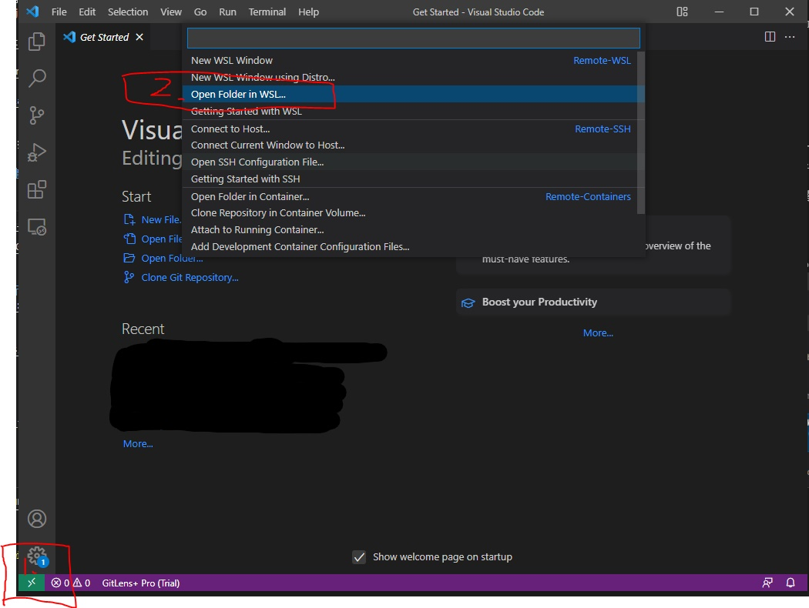
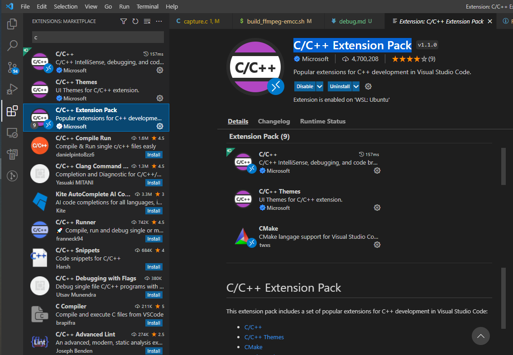
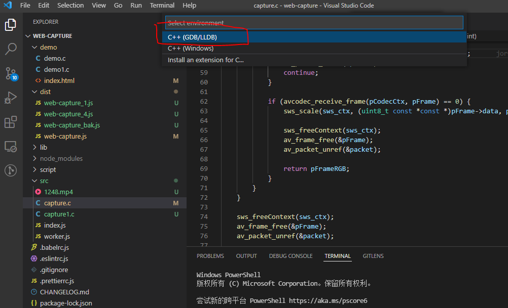

# 本地调试

## 原理
基于ffmpeg实现视频解码与截图，相关功能实现在[capture.c](./src/capture.c)文件，并通过Emscripten把ffmpeg和capture.c编译为js；最终生成文件为[web-capture.js](./dist/web-capture.js)，可以直接引用使用。

[asm.js 和 Emscripten 入门教程](https://www.ruanyifeng.com/blog/2017/09/asmjs_emscripten.html)

[emscripten安装](https://emscripten.org/docs/getting_started/downloads.html)

[FFMPEG开发快速入坑](https://zhuanlan.zhihu.com/p/345402619)

## 本地开发调试（Windows+WSL2）
主要环境：Windows10，并开启Linux子系统安装Ubuntu；VSCode安装在windows环境，并通过Remote - WSL扩展连接到Ubuntu子系统。
### 1.Windows环境 C/C++开发环境搭建
1. 安装VScode
2. 安装Remote - WSL扩展

3. 通过Remote - WSL扩展连接到Ubuntu子系统,并选择web-capture目录打开
   
4. 安装C/C++扩展
   

### 2. FFMPEG下载与编译
**以下操作在web-capture所在目录进行**
1. 下载 [ffmpeg-4.4.1.tar.xz](http://ffmpeg.org/releases/ffmpeg-4.4.1.tar.xz) 并解压至与 `web-capture` 同级的目录
   ```
   # web-capture 同级目录
   wget http://ffmpeg.org/releases/ffmpeg-4.4.1.tar.xz
   tar xvf ffmpeg-4.4.1.tar.xz
   ```
2. 编译ffmpeg
    ```
    sh ./web-capture/script/build_ffmpeg.sh
    ```

### 3. 开始调试
选中capture.c文件，并按F5按键开启调试，初次会生成launch.json和tasks.json文件


command
```

/usr/bin/gcc-9 -fdiagnostics-color=always -g /home/meng/repo/web-capture/src/capture.c -L/home/meng/repo/web-capture/lib/ffmpeg/lib -I/home/meng/repo/web-capture/lib/ffmpeg/include -lavcodec -lavdevice -lavfilter -lavformat -lavutil -lpostproc -lswscale -lswresample -lm -lpthread -ldl -o /home/meng/repo/web-capture/src/capture

                "-L",
                "${workspaceFolder}/lib/ffmpeg4/lib",
                "-I",
                "${workspaceFolder}/lib/ffmpeg4/include",
                "-l",
                "avutil",
                "-l",
                "avformat",
                "-l",
                "avcodec",
                "-l",
                "swscale",
                "-l",
                "m",
                "-l",
                "pthread",
                "-l",
                "swresample",
                "-l",
                "dl",
```